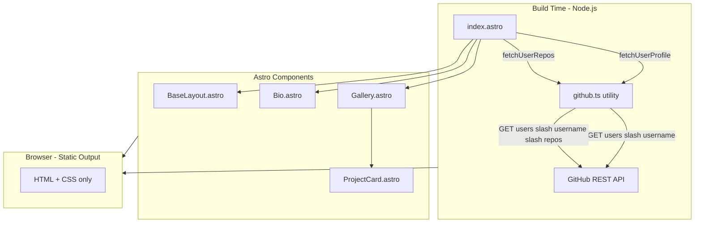
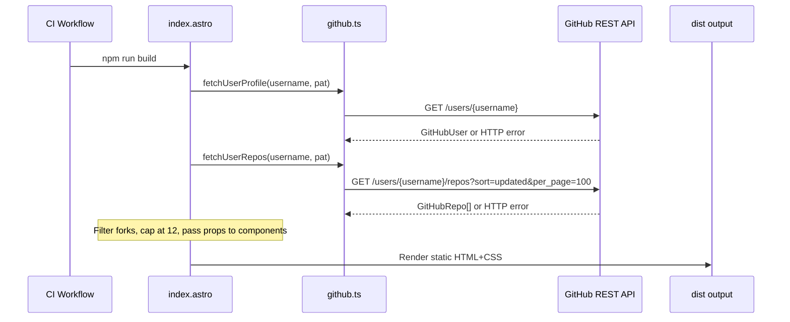

# Technical Design: GitHub Portfolio Landing Page

## Overview

This feature delivers a static personal portfolio landing page for an ML/AI professional. The page presents a bio section (profile picture, name, summary, social links) followed by a curated gallery of the owner's original GitHub repositories — all rendered from GitHub API data fetched once at build time.

**Users**: Recruiters, collaborators, and link-share recipients arriving from GitHub, CV links, or direct shares. They need a fast, visually polished first impression with immediate access to the owner's work.

**Impact**: Creates the `src/` directory tree from scratch; introduces the GitHub data utility, all UI components, the base layout, and CI/CD wiring for secrets.

### Goals
- Deliver a fully static, zero-client-JS portfolio page deployed to GitHub Pages
- Fetch GitHub profile and repository data at build time using a fine-grained PAT
- Support dark mode automatically via OS preference (`prefers-color-scheme`)
- Pass Lighthouse Performance ≥ 90 and Accessibility ≥ 90 on desktop

### Non-Goals
- Manual dark/light mode toggle (OS preference is the sole signal)
- Repository curation UI or topic filtering (potential future spec)
- Server-side rendering or any runtime backend
- CMS or admin interface for bio content
- Internationalization

---

## Architecture

### Architecture Pattern & Boundary Map

**Selected pattern**: Layered SSG — data utilities → page orchestration → presentational components → static output. All execution is build-time; the browser receives only HTML and CSS.



**Boundary decisions**:
- `github.ts` is the only component that touches the GitHub API — all other components receive typed props.
- `index.astro` is the sole data-fetching orchestrator; components are purely presentational.
- No client-side JS crosses the build/browser boundary (no Astro islands required).
- Dark mode is achieved entirely via CSS `prefers-color-scheme` media query through Tailwind `dark:` variants — zero JS.

### Technology Stack

| Layer | Choice / Version | Role | Notes |
|-------|-----------------|------|-------|
| Framework | Astro 6 | SSG, file routing, component model | Static output mode |
| Styling | Tailwind CSS v4 + `@tailwindcss/vite` | All visual design; dark mode via `dark:` variant | No `tailwind.config.*` needed in v4 |
| Language | TypeScript strict | All frontmatter and utility code | No `any`; strict null checks |
| Data source | GitHub REST API v3 | User profile + public repos at build time | Authenticated with `GITHUB_PAT` |
| Runtime | Node.js 22 | Build process | Matches CI environment |
| CI/CD | GitHub Actions + `withastro/action@v3` | Build, audit, deploy to GitHub Pages | Secrets injected as env vars |

---

## System Flows

### Build-Time Data Fetch and Render



Key decision: if either API call returns an error, `github.ts` throws and the build process exits non-zero — satisfying requirement 3.4.

---

## Requirements Traceability

| Req | Summary | Component | Interface | Flow |
|-----|---------|-----------|-----------|------|
| 1.1 | Bio: name, summary, social links | `Bio.astro` | `BioProps` | Build-time render |
| 1.2 | Bio: profile picture from `avatar_url` | `Bio.astro` | `BioProps.avatarUrl` | Build-time render |
| 1.3 | Bio: fallback if avatar fails | `Bio.astro` | `BioProps.avatarUrl` optional | CSS fallback |
| 1.4 | Bio above gallery | `index.astro` | Component order | DOM order |
| 1.5 | Bio: static HTML only | `Bio.astro` | Props-only, no island | No `client:*` directive |
| 1.6 | Social links: new tab + noopener | `Bio.astro` | `BioProps.links` | Rendered anchor attrs |
| 2.1 | Gallery: one card per repo | `Gallery.astro` | `GalleryProps.repos` | Props iteration |
| 2.2 | Card: name, description, language, link | `ProjectCard.astro` | `ProjectCardProps` | Static render |
| 2.3 | Card: thumbnail if `social_preview_image_url` | `ProjectCard.astro` | `ProjectCardProps.previewImageUrl` | Conditional render |
| 2.4 | Card: placeholder if no description | `ProjectCard.astro` | `ProjectCardProps.description` nullable | Null coalesce |
| 2.5 | Card links: new tab + noopener | `ProjectCard.astro` | `ProjectCardProps.htmlUrl` | Rendered anchor attrs |
| 2.6 | Gallery: responsive grid | `Gallery.astro` | Tailwind grid classes | CSS grid |
| 3.1 | Fetch repos with `GITHUB_PAT` | `github.ts` | `fetchUserRepos` | Build-time fetch |
| 3.2 | Read username from env | `github.ts` | `import.meta.env` | Env var access |
| 3.3 | Fetch name, description, language, url, preview | `github.ts` | `GitHubRepo` type | API response mapping |
| 3.4 | Fail build on API error | `github.ts` | Error throw | CI failure |
| 3.5 | Never expose PAT to browser | `github.ts` | Non-PUBLIC_ env var | Astro env scoping |
| 3.6 | Authenticated requests for rate limit | `github.ts` | `Authorization` header | Bearer token |
| 4.1 | Static HTML, no client-side JS | All components | No `client:*` | SSG output |
| 4.2 | Lighthouse Performance ≥ 90 | All | Minimal assets | SSG + no JS |
| 4.3 | Zero JS for non-interactive components | All | No Astro islands | Props-only |
| 4.4 | Valid HTML5 | `BaseLayout.astro` | DOCTYPE, semantic structure | Layout shell |
| 5.1 | `<title>` + `<meta description>` | `BaseLayout.astro` | `BaseLayoutProps` | Head section |
| 5.2 | Semantic HTML elements | All | `<header>`, `<main>`, `<section>`, `<article>` | Markup structure |
| 5.3 | `alt` text on all images | `Bio.astro`, `ProjectCard.astro` | `alt` attrs | Prop-driven |
| 5.4 | Lighthouse Accessibility ≥ 90 | All | ARIA, contrast, structure | Design constraint |
| 5.5 | Keyboard navigable | All | Focus order, anchor elements | No JS traps |
| 6.1 | Responsive 320–1440 px | All | Tailwind responsive prefixes | CSS breakpoints |
| 6.2 | `viewport` meta tag | `BaseLayout.astro` | `<meta name="viewport">` | Head |
| 6.3 | Touch targets ≥ 44×44 px | `ProjectCard.astro`, `Bio.astro` | Tailwind sizing | Mobile CSS |
| 6.4–6.5 | Dark mode via OS preference | All | Tailwind `dark:` variants | CSS media query |
| 6.6 | Tailwind-only styling | All | Utility classes | No hand-written CSS |
| 6.7 | Favicon | `BaseLayout.astro` | `<link rel="icon">` | `public/favicon.*` |
| 6.8 | OG meta tags | `BaseLayout.astro` | `BaseLayoutProps.ogImage` | Head section |
| 7.1 | Auto-deploy on push to `main` | `.github/workflows/deploy.yml` | Existing workflow | Already wired |
| 7.2 | `npm ci` installs | CI workflow | `npm ci` step | Already wired |
| 7.3 | Deploy `dist/` to GitHub Pages | CI workflow | `withastro/action@v3` | Already wired |
| 7.4 | Fail on build error | CI workflow | Exit code propagation | Already wired |
| 7.5 | Security audit gate | CI workflow | `npm audit` step | Already wired |
| 7.6 | PAT + username as CI secrets | CI workflow | `secrets.*` | Already wired |

---

## Components and Interfaces

### Component Summary

| Component | Layer | Intent | Req Coverage | Key Dependencies | Contracts |
|-----------|-------|--------|--------------|------------------|-----------|
| `github.ts` | Data utility | Fetch and type GitHub API responses | 3.1–3.6 | GitHub REST API (P0) | Service |
| `BaseLayout.astro` | Layout | HTML shell, head meta, dark mode root | 4.4, 5.1, 5.2, 6.2, 6.7, 6.8 | — | State (props) |
| `index.astro` | Page | Orchestrate data fetch, pass props to components | 1.4, 3.1–3.6 | `github.ts` (P0) | — |
| `Bio.astro` | Component | Render profile picture, name, bio, social links | 1.1–1.6 | `GitHubUser` type (P0) | State (props) |
| `Gallery.astro` | Component | Responsive grid wrapper for project cards | 2.1, 2.6 | `GitHubRepo[]` type (P0) | State (props) |
| `ProjectCard.astro` | Component | Render individual repo card | 2.2–2.5 | `GitHubRepo` type (P0) | State (props) |

---

### Data Utility Layer

#### `src/utils/github.ts`

| Field | Detail |
|-------|--------|
| Intent | Fetch typed GitHub user profile and public repository data at build time |
| Requirements | 3.1, 3.2, 3.3, 3.4, 3.5, 3.6 |

**Responsibilities & Constraints**
- Single responsibility: HTTP calls to the GitHub REST API and response → typed value mapping.
- Throws a descriptive `Error` (with HTTP status) on any non-2xx response; never returns partial or empty data silently.
- Filters out forked repositories and sorts by `updated_at` descending; caps result at 12 repos.
- The `GITHUB_PAT` value is read from `import.meta.env` inside the calling page (`index.astro`), not from inside this module, so the module is pure and testable with injected credentials.

**Dependencies**
- Inbound: `index.astro` — calls both fetch functions with username and PAT (P0)
- External: GitHub REST API `api.github.com` — authoritative data source (P0)

**Contracts**: Service [x]

##### Service Interface

```typescript
// src/utils/github.ts

export interface GitHubUser {
  login: string;
  name: string | null;
  bio: string | null;
  avatar_url: string;
  html_url: string;
  blog: string | null;
}

export interface GitHubRepo {
  name: string;
  description: string | null;
  language: string | null;
  html_url: string;
  social_preview_image_url: string | null;
  stargazers_count: number;
  fork: boolean;
  updated_at: string;
}

export interface GitHubApiError extends Error {
  status: number;
}

export async function fetchUserProfile(
  username: string,
  pat: string
): Promise<GitHubUser>;

export async function fetchUserRepos(
  username: string,
  pat: string,
  limit?: number   // default 12
): Promise<GitHubRepo[]>;
```

- Preconditions: `username` is non-empty; `pat` is a valid fine-grained PAT with `Contents: read` and `Metadata: read`.
- Postconditions: `fetchUserProfile` returns a `GitHubUser`; `fetchUserRepos` returns a non-forked, sorted, capped `GitHubRepo[]`.
- Invariants: Both functions throw `GitHubApiError` (with `status`) on API failures. The `GITHUB_PAT` value never appears in any return value or thrown message.

**Implementation Notes**
- Integration: Called with `await` in `index.astro` frontmatter; both calls are sequential (profile then repos). They may be parallelised with `Promise.all` in a future optimisation.
- Validation: Check `response.ok` after each `fetch`; throw `GitHubApiError` with `response.status` and a human-readable message.
- Risks: GitHub API may return `social_preview_image_url: null` for repos without a custom OG image — this is handled gracefully by the `ProjectCard` component.

---

### Layout Layer

#### `src/layouts/BaseLayout.astro`

| Field | Detail |
|-------|--------|
| Intent | Provide the HTML shell with head metadata, viewport, OG tags, and dark mode CSS import |
| Requirements | 4.4, 5.1, 5.2, 6.2, 6.7, 6.8 |

**Contracts**: State (props) [x]

```typescript
interface Props {
  title: string;
  description: string;
  ogImage?: string;  // absolute URL; omit if not available
}
```

**Implementation Notes**
- Includes `<meta name="viewport" content="width=device-width, initial-scale=1">` (6.2).
- Imports `../styles/global.css` which contains `@import "tailwindcss"` — this is the Tailwind v4 entry point.
- `<html>` element has no `class="dark"` attribute; dark mode is driven purely by `prefers-color-scheme` via Tailwind.
- Includes `<link rel="icon">` pointing to `/favicon.ico` or `/favicon.svg` in `public/`.
- Includes `<meta property="og:*">` tags when `ogImage` prop is provided.

---

### Page Layer

#### `src/pages/index.astro`

| Field | Detail |
|-------|--------|
| Intent | Orchestrate build-time data fetch and compose the full page from layout and components |
| Requirements | 1.4, 3.1–3.6 |

**Implementation Notes**
- Reads `import.meta.env.GITHUB_PAT` and `import.meta.env.PUBLIC_GITHUB_USERNAME` in the frontmatter.
- Calls `fetchUserProfile` and `fetchUserRepos` from `github.ts`; passes results as props to `Bio` and `Gallery`.
- Wraps content in `BaseLayout` with appropriate `title`, `description`, and `ogImage` values.
- Render order in markup: `<Bio>` above `<Gallery>` (1.4).

---

### Component Layer

Presentational components receive typed props and contain no fetch logic. Full interface contracts below; all are summary-row components except where noted.

#### `src/components/Bio.astro`

```typescript
interface Props {
  user: GitHubUser;  // avatar_url, name, bio, html_url, blog
  links?: Array<{ label: string; href: string }>;  // additional social links
}
```

- Renders `` with a CSS fallback placeholder (requirement 1.2–1.3).
- All external links rendered as `<a href="..." target="_blank" rel="noopener noreferrer">` (1.6).
- Touch targets ≥ 44×44 px via Tailwind sizing classes (6.3).

#### `src/components/Gallery.astro`

```typescript
interface Props {
  repos: GitHubRepo[];
}
```

- Renders a responsive CSS grid: `grid-cols-1 sm:grid-cols-2 lg:grid-cols-3` (2.6, 6.1).
- Iterates `repos` and renders one `<ProjectCard>` per item.

#### `src/components/ProjectCard.astro`

```typescript
interface Props {
  repo: GitHubRepo;
}
```

- Conditionally renders thumbnail only when `repo.social_preview_image_url` is non-null (2.3).
- Renders `repo.description ?? "No description provided"` (2.4).
- Renders `repo.language ?? null` — omits the language badge entirely if null.
- Repo link: `<a href={repo.html_url} target="_blank" rel="noopener noreferrer">` (2.5).
- Touch target for the card link: minimum `p-3` padding to achieve ≥ 44×44 px tap area (6.3).

---

## Data Models

### Domain Model

Two read-only value objects, sourced entirely from the GitHub API:

- **`GitHubUser`** — profile snapshot: login, display name, bio, avatar URL, profile URL, blog URL. No mutations; used only to render the Bio section.
- **`GitHubRepo`** — repository snapshot: name, description, language, URL, preview image URL, star count, fork flag, last-updated timestamp. Filtered (non-forks only) and sorted before use.

No aggregates, no persistence, no mutations — data is baked into static HTML at build time.

### Data Contracts & Integration

**GitHub REST API — User Profile**

| Field | Type | Nullable | Used by |
|-------|------|----------|---------|
| `login` | `string` | No | Bio fallback name |
| `name` | `string` | Yes | Bio display name |
| `bio` | `string` | Yes | Bio summary |
| `avatar_url` | `string` | No | Bio profile image |
| `html_url` | `string` | No | Bio GitHub link |
| `blog` | `string` | Yes | Bio website link |

**GitHub REST API — Repos**

| Field | Type | Nullable | Used by |
|-------|------|----------|---------|
| `name` | `string` | No | ProjectCard title |
| `description` | `string` | Yes | ProjectCard description |
| `language` | `string` | Yes | ProjectCard language badge |
| `html_url` | `string` | No | ProjectCard link |
| `social_preview_image_url` | `string` | Yes | ProjectCard thumbnail |
| `fork` | `boolean` | No | Filter (exclude forks) |
| `updated_at` | `string` (ISO 8601) | No | Sort order |

---

## Error Handling

### Error Strategy

Fail-fast at build time; graceful degradation in the browser for optional UI elements.

### Error Categories and Responses

**Build-Time (GitHub API errors)**
- HTTP 4xx/5xx from GitHub API → `github.ts` throws `GitHubApiError` with status code and message → `index.astro` frontmatter propagates the throw → build process exits non-zero → CI pipeline fails with visible error output.
- Missing env vars (`GITHUB_PAT`, `PUBLIC_GITHUB_USERNAME`) → `undefined` passed to fetch → `401 Unauthorized` from API → caught and rethrown as above.

**Browser (graceful degradation)**
- `social_preview_image_url: null` → `ProjectCard` hides thumbnail slot; layout remains intact.
- `description: null` → `ProjectCard` renders placeholder text.
- `avatar_url` image load failure → CSS `background-color` placeholder via `onerror`-free approach: use `` with a `color` background on the container as fallback (no JS).
- `name: null` (GitHub user with no display name) → fall back to `login` (username).

### Monitoring

- Build failures surface in GitHub Actions logs with the HTTP status and API endpoint that failed.
- No runtime monitoring required (static site).

---

## Testing Strategy

### Build Integration Tests
- Verify `fetchUserProfile` returns a correctly typed `GitHubUser` when given valid credentials (mock HTTP layer).
- Verify `fetchUserRepos` filters forks, respects the limit, and sorts by `updated_at`.
- Verify `fetchUserRepos` throws `GitHubApiError` with the correct `status` on a 4xx response.
- Verify `fetchUserRepos` throws on a 5xx response.

### Visual / Snapshot Tests (manual or Playwright)
- Bio section renders profile image, name, bio, and social links on desktop and mobile.
- Gallery grid collapses to single column at 320 px viewport.
- Dark mode: component colors invert correctly at `prefers-color-scheme: dark`.
- ProjectCard with null `social_preview_image_url` renders without a broken image element.
- ProjectCard with null `description` renders "No description provided" placeholder.

### Lighthouse Audits (CI-gate)
- Performance ≥ 90 on desktop.
- Accessibility ≥ 90 on desktop.

---

## Security Considerations

- `GITHUB_PAT` is accessed via `import.meta.env.GITHUB_PAT` (no `PUBLIC_` prefix) — Astro strips it from the browser bundle automatically.
- Fine-grained PAT scoped to this repository only with minimum permissions (`Contents: read`, `Metadata: read`) — matches existing `.env.example` guidance.
- All external links use `rel="noopener noreferrer"` to prevent tab-napping.
- `npm audit --audit-level=high --omit=dev` in CI gates every deploy against known production vulnerabilities.
- No user input is accepted; XSS surface is limited to GitHub API response values rendered via Astro's default HTML escaping.

---

## Performance & Scalability

- **Target**: Lighthouse Performance ≥ 90 desktop. Achievable by default for a static HTML+CSS page with no render-blocking JS.
- **Image optimisation**: Profile picture and repo thumbnails are served from GitHub's CDN (`githubusercontent.com`, `opengraph.githubassets.com`). No image processing pipeline is required.
- **Bundle size**: Zero JS shipped for non-interactive components. Tailwind v4 generates only the CSS utilities referenced in source files (dead-code elimination is automatic).
- **Scalability**: Static output has no runtime scaling concerns. Build time grows linearly with repo count; capped at 12 repos by default.
