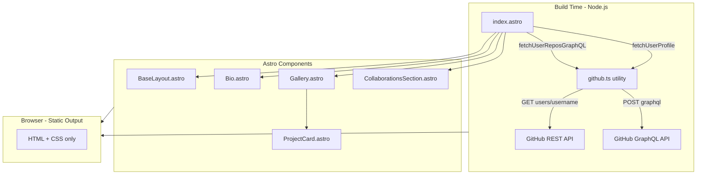
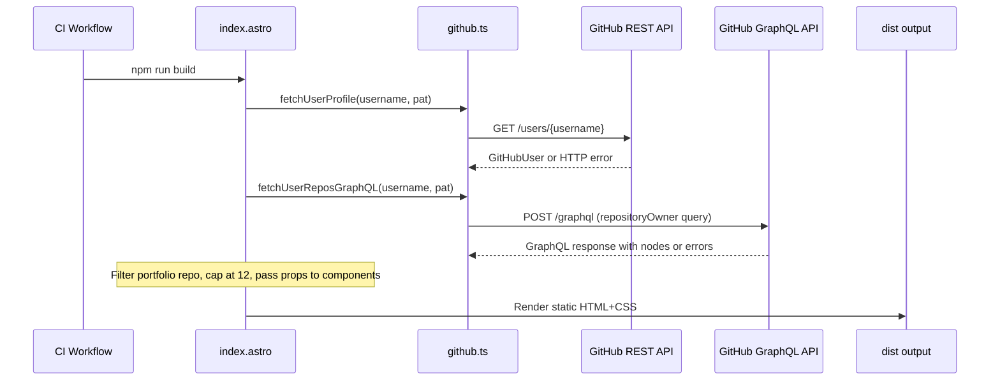

# Technical Design: GitHub Portfolio Landing Page

## Overview

This feature delivers a static personal portfolio landing page for an ML/AI professional. The page presents a bio section (profile picture, name, summary, social links), a curated gallery of the owner's original GitHub repositories, and a separate collaborations section for repos the owner contributes to but does not own — all rendered from GitHub API data fetched once at build time.

**Users**: Recruiters, collaborators, and link-share recipients arriving from GitHub, CV links, or direct shares. They need a fast, visually polished first impression with immediate access to the owner's work.

**Impact**: Creates the `src/` directory tree from scratch; introduces the GitHub data utility, all UI components, the base layout, and CI/CD wiring for secrets.

### Goals
- Deliver a fully static, zero-client-JS portfolio page deployed to GitHub Pages
- Fetch GitHub profile and repository data at build time using a fine-grained PAT
- Support dark mode automatically via OS preference (`prefers-color-scheme`)
- Pass Lighthouse Performance ≥ 90 and Accessibility ≥ 90 on desktop

### Non-Goals
- Manual dark/light mode toggle (OS preference is the sole signal)
- Repository curation UI or topic filtering (potential future spec)
- Server-side rendering or any runtime backend
- CMS or admin interface for bio content
- Internationalization

---

## Architecture

### Architecture Pattern & Boundary Map

**Selected pattern**: Layered SSG — data utilities → page orchestration → presentational components → static output. All execution is build-time; the browser receives only HTML and CSS.



**Boundary decisions**:
- `github.ts` is the only component that touches the GitHub API — all other components receive typed props.
- `index.astro` is the sole data-fetching orchestrator; components are purely presentational.
- No client-side JS crosses the build/browser boundary (no Astro islands required).
- Dark mode is achieved entirely via CSS `prefers-color-scheme` media query through Tailwind `dark:` variants — zero JS.
- Repository social preview images are only available via the GitHub GraphQL API; the REST API does not expose this field. `fetchUserReposGraphQL` replaces `fetchUserRepos` as the canonical repo-fetch function.
- `User.repositories` defaults to `affiliations: ["OWNER", "COLLABORATOR"]`, so a single GraphQL query already returns both owned and collaborator repos — no second API call is needed. `index.astro` splits the result by comparing `owner_login` to `PUBLIC_GITHUB_USERNAME`.

### Technology Stack

| Layer | Choice / Version | Role | Notes |
|-------|-----------------|------|-------|
| Framework | Astro 6 | SSG, file routing, component model | Static output mode |
| Styling | Tailwind CSS v4 + `@tailwindcss/vite` | All visual design; dark mode via `dark:` variant | No `tailwind.config.*` needed in v4 |
| Language | TypeScript strict | All frontmatter and utility code | No `any`; strict null checks |
| Data source (profile) | GitHub REST API v3 | User profile at build time | Authenticated with `GH_PAT` |
| Data source (repos) | GitHub GraphQL API v4 | Public repos + `openGraphImageUrl` at build time | Authenticated with `GH_PAT`; REST API does not expose `openGraphImageUrl` |
| Runtime | Node.js 22 | Build process | Matches CI environment |
| CI/CD | GitHub Actions + `withastro/action@v3` | Build, audit, deploy to GitHub Pages | Secrets injected as env vars |

---

## System Flows

### Build-Time Data Fetch and Render



Key decision: if either API call returns an error, `github.ts` throws and the build process exits non-zero — satisfying requirement 3.4. Both calls are issued concurrently via `Promise.all` in `index.astro`.

---

## Requirements Traceability

| Req | Summary | Component | Interface | Flow |
|-----|---------|-----------|-----------|------|
| 1.1 | Bio: name, summary, social links | `Bio.astro` | `BioProps` | Build-time render |
| 1.2 | Bio: profile picture from `avatar_url` | `Bio.astro` | `BioProps.avatarUrl` | Build-time render |
| 1.3 | Bio: fallback if avatar fails | `Bio.astro` | `BioProps.avatarUrl` optional | CSS fallback |
| 1.4 | Bio above gallery | `index.astro` | Component order | DOM order |
| 1.5 | Bio: static HTML only | `Bio.astro` | Props-only, no island | No `client:*` directive |
| 1.6 | Social links: new tab + noopener | `Bio.astro` | `BioProps.links` | Rendered anchor attrs |
| 2.1 | Gallery: one card per repo | `Gallery.astro` | `GalleryProps.repos` | Props iteration |
| 2.2 | Card: name, description, language, link | `ProjectCard.astro` | `ProjectCardProps` | Static render |
| 2.3 | Card: thumbnail via GraphQL `openGraphImageUrl` | `ProjectCard.astro` / `github.ts` | `GitHubRepo.social_preview_image_url` | GraphQL fetch → conditional render |
| 2.4 | Card: placeholder if no description | `ProjectCard.astro` | `ProjectCardProps.description` nullable | Null coalesce |
| 2.5 | Card links: new tab + noopener | `ProjectCard.astro` | `ProjectCardProps.htmlUrl` | Rendered anchor attrs |
| 2.6 | Gallery: responsive grid | `Gallery.astro` | Tailwind grid classes | CSS grid |
| 2.10 | Gallery restricted to owned repos only | `index.astro` | `ownedRepos` filter on `owner_login` | Post-fetch split |
| 3.1 | Fetch repos with `GH_PAT` | `github.ts` | `fetchUserReposGraphQL` | Build-time fetch |
| 3.2 | Read username from env | `github.ts` | `import.meta.env` | Env var access |
| 3.3 | Fetch name, description, language, url, preview | `github.ts` | `GitHubRepo` type | GraphQL response mapping |
| 3.4 | Fail build on API error | `github.ts` | Error throw | CI failure |
| 3.5 | Never expose PAT to browser | `github.ts` | Non-PUBLIC_ env var | Astro env scoping |
| 3.6 | Authenticated requests for rate limit | `github.ts` | `Authorization` header | Bearer token |
| 4.1 | Static HTML, no client-side JS | All components | No `client:*` | SSG output |
| 4.2 | Lighthouse Performance ≥ 90 | All | Minimal assets | SSG + no JS |
| 4.3 | Zero JS for non-interactive components | All | No Astro islands | Props-only |
| 4.4 | Valid HTML5 | `BaseLayout.astro` | DOCTYPE, semantic structure | Layout shell |
| 5.1 | `<title>` + `<meta description>` | `BaseLayout.astro` | `BaseLayoutProps` | Head section |
| 5.2 | Semantic HTML elements | All | `<header>`, `<main>`, `<section>`, `<article>` | Markup structure |
| 5.3 | `alt` text on all images | `Bio.astro`, `ProjectCard.astro` | `alt` attrs | Prop-driven |
| 5.4 | Lighthouse Accessibility ≥ 90 | All | ARIA, contrast, structure | Design constraint |
| 5.5 | Keyboard navigable | All | Focus order, anchor elements | No JS traps |
| 6.1 | Responsive 320–1440 px | All | Tailwind responsive prefixes | CSS breakpoints |
| 6.2 | `viewport` meta tag | `BaseLayout.astro` | `<meta name="viewport">` | Head |
| 6.3 | Touch targets ≥ 44×44 px | `ProjectCard.astro`, `Bio.astro` | Tailwind sizing | Mobile CSS |
| 6.4–6.5 | Dark mode via OS preference | All | Tailwind `dark:` variants | CSS media query |
| 6.6 | Tailwind-only styling | All | Utility classes | No hand-written CSS |
| 6.7 | Favicon | `BaseLayout.astro` | `<link rel="icon">` | `public/favicon.*` |
| 6.8 | OG meta tags | `BaseLayout.astro` | `BaseLayoutProps.ogImage` | Head section |
| 7.1 | Auto-deploy on push to `main` | `.github/workflows/deploy.yml` | Existing workflow | Already wired |
| 7.2 | `npm ci` installs | CI workflow | `npm ci` step | Already wired |
| 7.3 | Deploy `dist/` to GitHub Pages | CI workflow | `withastro/action@v3` | Already wired |
| 7.4 | Fail on build error | CI workflow | Exit code propagation | Already wired |
| 7.5 | Security audit gate | CI workflow | `npm audit` step | Already wired |
| 7.6 | PAT + username as CI secrets | CI workflow | `secrets.*` | Already wired |
| 8.1 | Collaborations section below main gallery | `CollaborationsSection.astro` / `index.astro` | Render order | DOM order after `<Gallery>` |
| 8.2 | Collaborations heading signals lesser ownership | `CollaborationsSection.astro` | `<h2>` text | Static markup |
| 8.3 | Each collaboration entry: repo name as link | `CollaborationsSection.astro` | `<a href={repo.html_url}>` | Static render |
| 8.4 | Simpler visual treatment (no thumbnail/desc/badge) | `CollaborationsSection.astro` | Omitted elements | Design constraint |
| 8.5 | Section omitted if no collaborator repos | `CollaborationsSection.astro` | `repos.length === 0` guard | Conditional render |
| 8.6 | Same GraphQL query; differentiate by `owner.login` | `github.ts` / `index.astro` | `owner_login` field + post-fetch split | Single-query strategy |

---

## Components and Interfaces

### Component Summary

| Component | Layer | Intent | Req Coverage | Key Dependencies | Contracts |
|-----------|-------|--------|--------------|------------------|-----------|
| `github.ts` | Data utility | Fetch and type GitHub API responses (REST + GraphQL) | 3.1–3.6 | GitHub REST API, GitHub GraphQL API (both P0) | Service |
| `BaseLayout.astro` | Layout | HTML shell, head meta, dark mode root | 4.4, 5.1, 5.2, 6.2, 6.7, 6.8 | — | State (props) |
| `index.astro` | Page | Orchestrate data fetch, split owned/collaborator repos, pass props to components | 1.4, 2.10, 3.1–3.6, 8.1, 8.5, 8.6 | `github.ts` (P0) | — |
| `Bio.astro` | Component | Render profile picture, name, bio, social links | 1.1–1.6 | `GitHubUser` type (P0) | State (props) |
| `Gallery.astro` | Component | Responsive grid wrapper for project cards | 2.1, 2.6, 2.10 | `GitHubRepo[]` type (P0) | State (props) |
| `ProjectCard.astro` | Component | Render individual repo card | 2.2–2.5 | `GitHubRepo` type (P0) | State (props) |
| `CollaborationsSection.astro` | Component | Render simple list of collaborator repos; renders nothing when list is empty | 8.1–8.5 | `GitHubRepo[]` type (P0) | State (props) |

---

### Data Utility Layer

#### `src/utils/github.ts`

| Field | Detail |
|-------|--------|
| Intent | Fetch typed GitHub user profile (REST) and public repository data including social preview images (GraphQL) at build time |
| Requirements | 3.1, 3.2, 3.3, 3.4, 3.5, 3.6 |

**Responsibilities & Constraints**
- Single responsibility: HTTP calls to the GitHub APIs and response → typed value mapping.
- Throws a descriptive `GitHubApiError` (with HTTP status or GraphQL error message) on any failure; never returns partial or empty data silently.
- `fetchUserReposGraphQL` issues a single GraphQL query that returns repos ordered by `UPDATED_AT DESC`, including both owned repos and collaborator repos (GitHub's default `affiliations: ["OWNER", "COLLABORATOR"]`), filtered to non-forks (`isFork: false`), then excludes the `<username>.github.io` portfolio repo by name after receipt of the response.
- Each returned `GitHubRepo` includes `owner_login` (mapped from `owner.login` in the GraphQL response), allowing the caller to differentiate owned from collaborator repos without a second API call.
- Caps the returned array at `limit` repos (default: 12) after filtering and exclusion; this cap applies to owned repos only — collaborator repos are not capped.
- The `GH_PAT` value is read from `import.meta.env` inside the calling page (`index.astro`), not from inside this module, so the module is pure and testable with injected credentials.
- No new npm dependencies are introduced; the GraphQL request uses native `fetch()` with a JSON body.

**Dependencies**
- Inbound: `index.astro` — calls `fetchUserProfile` and `fetchUserReposGraphQL` with username and PAT (P0)
- External: GitHub REST API `api.github.com/users/{username}` — user profile data source (P0)
- External: GitHub GraphQL API `api.github.com/graphql` — repository data source including `openGraphImageUrl` (P0)

**Contracts**: Service [x]

##### Service Interface

```typescript
// src/utils/github.ts

export interface GitHubUser {
  login: string;
  name: string | null;
  bio: string | null;
  avatar_url: string;
  html_url: string;
  blog: string | null;
}

export interface GitHubRepo {
  name: string;
  description: string | null;
  language: string | null;
  html_url: string;
  social_preview_image_url: string | null;
  stargazers_count: number;
  fork: boolean;
  updated_at: string;
  owner_login: string;  // login of the repo owner; used to split owned vs collaborator repos
}

export class GitHubApiError extends Error {
  status: number;
}

// Internal interface — not exported; typed representation of a single node
// in the GraphQL repositoryOwner.repositories.nodes response array.
interface GraphQLRepoNode {
  name: string;
  description: string | null;
  primaryLanguage: { name: string } | null;
  url: string;
  openGraphImageUrl: string;   // URI! — always present; falls back to GitHub-generated OG image
  stargazerCount: number;
  updatedAt: string;
  isFork: boolean;
  owner: { login: string };    // Repo owner login; used to differentiate owned vs collaborator repos
}

export async function fetchUserProfile(
  username: string,
  pat: string
): Promise<GitHubUser>;

// Replaces fetchUserRepos. POSTs to the GitHub GraphQL API to obtain
// openGraphImageUrl (unavailable via REST). Maps GraphQL field names to
// the GitHubRepo interface and applies post-fetch filtering and capping.
export async function fetchUserReposGraphQL(
  username: string,
  pat: string,
  limit?: number   // default 12
): Promise<GitHubRepo[]>;
```

**GraphQL Query Contract**

`fetchUserReposGraphQL` issues a single `POST https://api.github.com/graphql` request with the following query structure (variables: `$login: String!`, `$limit: Int!`):

```graphql
query PortfolioRepos($login: String!, $limit: Int!) {
  repositoryOwner(login: $login) {
    repositories(
      first: $limit
      isFork: false
      orderBy: { field: UPDATED_AT, direction: DESC }
      privacy: PUBLIC
    ) {
      nodes {
        name
        description
        primaryLanguage { name }
        url
        openGraphImageUrl
        stargazerCount
        updatedAt
        isFork
        owner { login }
      }
    }
  }
}
```

> Note: `User.repositories` defaults to `affiliations: ["OWNER", "COLLABORATOR"]`, so this single query already returns both owned repos and repos where the authenticated user is a collaborator. No second query is required (Req 8.6).

The request body is `application/json` with `{ query, variables }`. Headers: `Authorization: Bearer <pat>`, `Content-Type: application/json`.

**Field Mapping: GraphQL → `GitHubRepo`**

| GraphQL field (`GraphQLRepoNode`) | `GitHubRepo` field | Notes |
|-----------------------------------|--------------------|-------|
| `name` | `name` | Direct |
| `description` | `description` | Nullable; null preserved |
| `primaryLanguage.name` | `language` | Null when `primaryLanguage` is null |
| `url` | `html_url` | GraphQL uses `url`; interface uses REST naming |
| `openGraphImageUrl` | `social_preview_image_url` | `URI!` from API; treat as nullable in interface to preserve forward-compat |
| `stargazerCount` | `stargazers_count` | GraphQL uses camelCase singular; interface uses REST snake_case plural |
| `updatedAt` | `updated_at` | ISO 8601; GraphQL camelCase → interface snake_case |
| `isFork` | `fork` | Used for post-fetch filtering only; not consumed by components |
| `owner.login` | `owner_login` | Used in `index.astro` to split owned vs collaborator repos; not rendered directly |

**Error Handling in `fetchUserReposGraphQL`**

- HTTP non-2xx response → throw `GitHubApiError` with `response.status`.
- `data.errors` present in a 200 response body → throw `GitHubApiError` with `status: 200` and the first error message from `data.errors[0].message`.
- `data.data.repositoryOwner` is null (no such user) → throw `GitHubApiError` with a descriptive message.

- Preconditions: `username` is non-empty; `pat` is a valid fine-grained PAT with `Contents: read` and `Metadata: read`.
- Postconditions: returns a non-forked, portfolio-repo-excluded, `updatedAt`-sorted `GitHubRepo[]` where every item has `owner_login` populated. The array includes both owned repos (capped at `limit`) and collaborator repos (uncapped).
- Invariants: `GitHubApiError` is thrown on all failure modes. The `GH_PAT` value never appears in any return value or thrown message.

**Implementation Notes**
- No new library dependencies. The GraphQL request is issued with native `fetch()` and a JSON body — the same runtime already used by `fetchUserProfile`.
- The `openGraphImageUrl` field is typed `URI!` (non-null) in the GitHub GraphQL schema, meaning GitHub always returns a value (falling back to a generated preview for repos with no custom OG image). The `GitHubRepo` interface retains `social_preview_image_url: string | null` for defensive typing and forward-compatibility; callers should treat any non-empty string as a valid image URL.
- `fetchUserProfile` (REST) and `fetchUserReposGraphQL` (GraphQL) are called concurrently via `Promise.all` in `index.astro` for build-time parallelism.

---

### Layout Layer

#### `src/layouts/BaseLayout.astro`

| Field | Detail |
|-------|--------|
| Intent | Provide the HTML shell with head metadata, viewport, OG tags, and dark mode CSS import |
| Requirements | 4.4, 5.1, 5.2, 6.2, 6.7, 6.8 |

**Contracts**: State (props) [x]

```typescript
interface Props {
  title: string;
  description: string;
  ogImage?: string;  // absolute URL; omit if not available
}
```

**Implementation Notes**
- Includes `<meta name="viewport" content="width=device-width, initial-scale=1">` (6.2).
- Imports `../styles/global.css` which contains `@import "tailwindcss"` — this is the Tailwind v4 entry point.
- `<html>` element has no `class="dark"` attribute; dark mode is driven purely by `prefers-color-scheme` via Tailwind.
- Includes `<link rel="icon">` pointing to `/favicon.ico` or `/favicon.svg` in `public/`.
- Includes `<meta property="og:*">` tags when `ogImage` prop is provided.

---

### Page Layer

#### `src/pages/index.astro`

| Field | Detail |
|-------|--------|
| Intent | Orchestrate build-time data fetch, split repos into owned/collaborator arrays, and compose the full page from layout and components |
| Requirements | 1.4, 2.10, 3.1–3.6, 8.1, 8.5, 8.6 |

**Implementation Notes**
- Reads `import.meta.env.GH_PAT` and `import.meta.env.PUBLIC_GITHUB_USERNAME` in the frontmatter.
- Calls `fetchUserProfile` (REST) and `fetchUserReposGraphQL` (GraphQL) from `github.ts` concurrently via `Promise.all`.
- After the single GraphQL response is received, splits repos into two arrays:
  ```typescript
  const ownedRepos = repos.filter(r => r.owner_login === username);
  const collaboratorRepos = repos.filter(r => r.owner_login !== username);
  ```
- Passes `ownedRepos` to `<Gallery>` (main project gallery, Req 2.10) and `collaboratorRepos` to `<CollaborationsSection>` (Req 8.1, 8.6).
- `<CollaborationsSection>` handles the empty-list case internally (renders nothing when `repos.length === 0`), so `index.astro` does not need a conditional (Req 8.5).
- `fetchUserReposGraphQL` replaces the earlier `fetchUserRepos` (REST-only) call; the REST function is retained only for `fetchUserProfile`.
- Wraps content in `BaseLayout` with appropriate `title`, `description`, and `ogImage` values.
- Render order in markup: `<Bio>` → `<Gallery>` → `<CollaborationsSection>` (1.4, 8.1).

---

### Component Layer

Presentational components receive typed props and contain no fetch logic. Full interface contracts below; all are summary-row components except where noted.

#### `src/components/Bio.astro`

```typescript
interface Props {
  user: GitHubUser;  // avatar_url, name, bio, html_url, blog
  links?: Array<{ label: string; href: string }>;  // additional social links
}
```

- Renders `` with a CSS fallback placeholder (requirement 1.2–1.3).
- All external links rendered as `<a href="..." target="_blank" rel="noopener noreferrer">` (1.6).
- Touch targets ≥ 44×44 px via Tailwind sizing classes (6.3).

#### `src/components/Gallery.astro`

```typescript
interface Props {
  repos: GitHubRepo[];
}
```

- Renders a responsive CSS grid: `grid-cols-1 sm:grid-cols-2 lg:grid-cols-3` (2.6, 6.1).
- Iterates `repos` and renders one `<ProjectCard>` per item.

#### `src/components/ProjectCard.astro`

```typescript
interface Props {
  repo: GitHubRepo;
}
```

- Conditionally renders thumbnail only when `repo.social_preview_image_url` is non-null (2.3).
- Renders `repo.description ?? "No description provided"` (2.4).
- Renders `repo.language ?? null` — omits the language badge entirely if null.
- Repo link: `<a href={repo.html_url} target="_blank" rel="noopener noreferrer">` (2.5).
- Touch target for the card link: minimum `p-3` padding to achieve ≥ 44×44 px tap area (6.3).
- Unchanged by the collaborations feature; only receives owned repos via `Gallery`.

#### `src/components/CollaborationsSection.astro`

```typescript
interface Props {
  repos: GitHubRepo[];
}
```

- Renders nothing (no DOM output) when `repos.length === 0` — satisfies Req 8.5 without requiring a conditional in `index.astro`.
- When repos are present, renders a `<section>` containing:
  - A heading (e.g. `<h2>Collaborations</h2>` or "Open Source Contributions") — Req 8.2.
  - A `<ul>` where each `<li>` contains a single `<a href={repo.html_url} target="_blank" rel="noopener noreferrer">{repo.name}</a>` — Req 8.3.
- Intentionally omits social preview thumbnail, description, and language badge — simpler visual treatment per Req 8.4.
- Approximately 20 lines of markup; no data-fetching logic.

---

## Data Models

### Domain Model

Two read-only value objects, sourced entirely from the GitHub API:

- **`GitHubUser`** — profile snapshot: login, display name, bio, avatar URL, profile URL, blog URL. No mutations; used only to render the Bio section. Sourced from the GitHub REST API.
- **`GitHubRepo`** — repository snapshot: name, description, language, URL, preview image URL, star count, fork flag, last-updated timestamp, owner login. Filtered (non-forks only, portfolio repo excluded) and sorted before use; split into owned/collaborator arrays by `owner_login` in `index.astro`. Sourced from the GitHub GraphQL API.

No aggregates, no persistence, no mutations — data is baked into static HTML at build time.

### Data Contracts & Integration

**GitHub REST API — User Profile**

| Field | Type | Nullable | Used by |
|-------|------|----------|---------|
| `login` | `string` | No | Bio fallback name |
| `name` | `string` | Yes | Bio display name |
| `bio` | `string` | Yes | Bio summary |
| `avatar_url` | `string` | No | Bio profile image |
| `html_url` | `string` | No | Bio GitHub link |
| `blog` | `string` | Yes | Bio website link |

**GitHub GraphQL API — Repository Nodes**

| GraphQL field | GraphQL type | `GitHubRepo` field | Used by |
|---------------|--------------|--------------------|---------|
| `name` | `String!` | `name` | ProjectCard title |
| `description` | `String` | `description` | ProjectCard description |
| `primaryLanguage.name` | `String` (nullable object) | `language` | ProjectCard language badge |
| `url` | `URI!` | `html_url` | ProjectCard link |
| `openGraphImageUrl` | `URI!` | `social_preview_image_url` | ProjectCard thumbnail |
| `stargazerCount` | `Int!` | `stargazers_count` | (reserved; not currently displayed) |
| `updatedAt` | `DateTime!` | `updated_at` | Sort order |
| `isFork` | `Boolean!` | `fork` | Filter (exclude forks) |
| `owner.login` | `String!` | `owner_login` | Split owned vs collaborator repos in `index.astro` |

Query parameters applied server-side: `isFork: false`, `orderBy: { field: UPDATED_AT, direction: DESC }`, `privacy: PUBLIC`. Default affiliation includes `OWNER` and `COLLABORATOR`. Post-fetch: exclude `<username>.github.io`, cap owned repos at `limit` (default 12), split into `ownedRepos` and `collaboratorRepos` by `owner_login`.

---

## Error Handling

### Error Strategy

Fail-fast at build time; graceful degradation in the browser for optional UI elements.

### Error Categories and Responses

**Build-Time (GitHub API errors)**
- HTTP 4xx/5xx from GitHub REST API → `github.ts` throws `GitHubApiError` with status code and message → `index.astro` frontmatter propagates the throw → build process exits non-zero → CI pipeline fails with visible error output.
- HTTP 4xx/5xx from GitHub GraphQL API endpoint → same path as above.
- GraphQL 200 response with `data.errors` present → `github.ts` throws `GitHubApiError` with `status: 200` and the first GraphQL error message — treated identically to an HTTP error for build-failure purposes.
- `data.data.repositoryOwner` is null → `github.ts` throws `GitHubApiError` with a descriptive message indicating the username was not found.
- Missing env vars (`GH_PAT`, `PUBLIC_GITHUB_USERNAME`) → `undefined` passed to fetch → `401 Unauthorized` from API → caught and rethrown as above.

**Browser (graceful degradation)**
- `social_preview_image_url: null` → `ProjectCard` hides thumbnail slot; layout remains intact.
- `description: null` → `ProjectCard` renders placeholder text.
- `avatar_url` image load failure → CSS `background-color` placeholder via `onerror`-free approach: use `` with a `color` background on the container as fallback (no JS).
- `name: null` (GitHub user with no display name) → fall back to `login` (username).

### Monitoring

- Build failures surface in GitHub Actions logs with the HTTP status and API endpoint that failed.
- No runtime monitoring required (static site).

---

## Testing Strategy

### Build Integration Tests
- Verify `fetchUserProfile` returns a correctly typed `GitHubUser` when given valid credentials (mock HTTP layer).
- Verify `fetchUserReposGraphQL` maps GraphQL field names (`openGraphImageUrl`, `stargazerCount`, `updatedAt`, `url`, `primaryLanguage`, `owner.login`) to `GitHubRepo` interface fields correctly, including `owner_login`.
- Verify `fetchUserReposGraphQL` filters the portfolio repo by name, respects the limit for owned repos, and preserves `UPDATED_AT DESC` ordering from the API response.
- Verify `fetchUserReposGraphQL` returns both owned repos (`owner_login === username`) and collaborator repos (`owner_login !== username`) in a single call.
- Verify `fetchUserReposGraphQL` throws `GitHubApiError` when the HTTP response is 4xx/5xx.
- Verify `fetchUserReposGraphQL` throws `GitHubApiError` when the response body contains `data.errors`.
- Verify `fetchUserReposGraphQL` throws `GitHubApiError` when `data.data.repositoryOwner` is null.
- Verify `index.astro` splits the result correctly: `ownedRepos` contains only repos where `owner_login === username`; `collaboratorRepos` contains the rest.

### Visual / Snapshot Tests (manual or Playwright)
- Bio section renders profile image, name, bio, and social links on desktop and mobile.
- Gallery grid collapses to single column at 320 px viewport.
- Dark mode: component colors invert correctly at `prefers-color-scheme: dark`.
- ProjectCard with null `social_preview_image_url` renders without a broken image element.
- ProjectCard with null `description` renders "No description provided" placeholder.
- CollaborationsSection renders correctly when collaborator repos are present.
- CollaborationsSection renders nothing (no DOM element) when `repos` is empty.
- Collaborations entries contain only a repo name link — no thumbnail, description, or language badge.

### Lighthouse Audits (CI-gate)
- Performance ≥ 90 on desktop.
- Accessibility ≥ 90 on desktop.

---

## Security Considerations

- `GH_PAT` is accessed via `import.meta.env.GH_PAT` (no `PUBLIC_` prefix) — Astro strips it from the browser bundle automatically.
- Fine-grained PAT scoped to this repository only with minimum permissions (`Contents: read`, `Metadata: read`) — matches existing `.env.example` guidance. The same PAT authenticates both the REST profile fetch and the GraphQL repo fetch.
- All external links use `rel="noopener noreferrer"` to prevent tab-napping.
- `npm audit --audit-level=high --omit=dev` in CI gates every deploy against known production vulnerabilities.
- No user input is accepted; XSS surface is limited to GitHub API response values rendered via Astro's default HTML escaping.

---

## Performance & Scalability

- **Target**: Lighthouse Performance ≥ 90 desktop. Achievable by default for a static HTML+CSS page with no render-blocking JS.
- **Image optimisation**: Profile picture and repo thumbnails are served from GitHub's CDN (`githubusercontent.com`, `opengraph.githubassets.com`). No image processing pipeline is required.
- **Bundle size**: Zero JS shipped for non-interactive components. Tailwind v4 generates only the CSS utilities referenced in source files (dead-code elimination is automatic).
- **Scalability**: Static output has no runtime scaling concerns. Build time grows linearly with repo count; capped at 12 repos by default.
- **Single GraphQL request**: The switch from REST to GraphQL for repo data consolidates what previously required a separate per-repo API call (for OG images) into a single query, reducing build-time API round trips.
